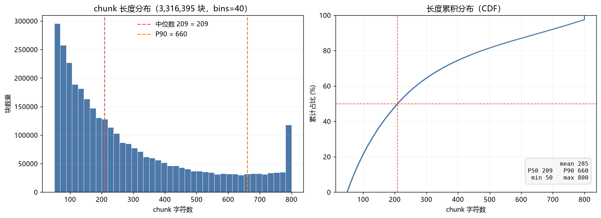

# 中文维基百科 RAG 知识库

从 [zhwiki](https://dumps.wikimedia.org/zhwiki/) 原始 dump 到可检索向量库的**完整数据管道**。
每一层都有可复现的验收标准和实测数字 —— 不是"跑通了"，是"能拿出证据说它好"。

> 当前进度：**M1 数据管道（第 1–6 步）+ M2 向量化与检索（第 7–8 步）+ M3 生成与引用（第 9 步）已完成**。
> `提问 → 混合检索 → 带 [n] 引用的答案` 已端到端跑通，含拒答机制与 Gradio 演示界面。

---

## 一句话架构

```
zhwiki dump (3.4 GB bz2)
   ↓  ① bz2 流式解压 + 多流索引定位（不落整份 XML）
   ↓  ② iterparse 增量解析 + 命名空间剥离
wiki.jsonl (9.2 GB, 1,507,969 篇)
   ↓  ③ PySpark 清洗：维基语法、模板、注释、命名空间链接
   ↓  ④ title-aware 切块（段落级 + section 归属）
   ↓  ⑤ 质量过滤（长度 / 中文占比 / 空壳）+ 两级去重
chunks.parquet (2.1 GB, 3,316,395 块)
   ↓  ⑥ 人工抽样审计
   ↓  ⑦ bge-large-zh 向量化（331.6 万 × 1024 维 fp16）→ faiss IVF 索引
   ↓  ⑧ BM25 倒排 + 向量召回 → RRF 融合 → top-5
   ↓  ⑨ 组装带编号的上下文 → LLM 生成「带 [n] 引用」的答案 + 拒答
```

---

## 数据规模（本地全量实测）

| 阶段 | 数值 |
|---|---|
| 原始 dump | 3.4 GB（bz2） |
| 解析出的 JSONL | 9.2 GB / **1,507,969** 篇 |
| 清洗后（正文 ≥ 200 字） | **866,112** 篇（淘汰 641,857 = 42.5%） |
| 文档级去重后 | **866,103** 篇（重复 9 篇） |
| 切块产出 | **3,709,162** 块（平均 4.28 块/篇） |
| 质量过滤剔除 | 357,575 块（9.6%） |
| chunk 级去重剔除 | 35,192 块 |
| **最终入库** | **3,316,395 块 / 2.1 GB** |
| 有效文档覆盖 | **833,615** 篇（有块留存的；32,488 篇的所有块都被质量过滤剔光） |
| 性能 | **371.6 秒 / 4,058 文档/秒**（`local[4]`，单机笔记本） |

**形态对比本身就是一个知识点**：JSONL 中间态是"必要的浪费"（比 bz2 膨胀 2.7×），
但必须在下游压成列存 —— 否则向量化阶段光是逐行读盘就吃不消（2.1 GB vs 9.2 GB，差 4.4 倍）。

---

## 六项审计表（第 6 步产物）

| 审计项 | 值 | 怎么来的 |
|---|---|---|
| **可溯源** | chunk 内带 `doc_id` / `title` / `section` | Parquet schema；`section` 有值率 **78.5%**（空值多属短条目导语段） |
| **抽样通过率** | **50 / 50 = 100%** | 人工逐条读 50 条（`seed=42` 固定可复现），见 [`eval/audit_sample.md`](eval/audit_sample.md) |
| **文档重复率** | **0.001%** | 管道统计 `doc_dedup_rate`（866,112 → 866,103，剔 9 篇） |
| **chunk 过滤率** | **10.59%** | 管道统计 `chunk_filter_rate`（3,709,162 → 3,316,395） |
| **chunk 长度分布** | min 50 / **P50 209** / mean 285 / max 800 | 全量 331 万块 `char_len` 直方图，见下节 |
| **时效性** | **未实现** | 当前 dump 不含 `last_modified`，无法按时间过滤；计划 M2 阶段补 |

> **抽样通过率的判定口径**：通顺 / 自洽 / 有信息量 / 无标记，四条全中才算通过。
> 第一轮人工判定为 48/50，其中 2 条经复核撤回 ——
> **原因是审计材料缺失 `section` 字段，属工具缺陷而非数据缺陷**，
> 完整复核过程记在 [`eval/audit_sample.md`](eval/audit_sample.md) 末尾。

---

## chunk 长度分布



三条判读（这是这张图真正的用途）：

1. **没有全挤在最左边** —— `<100 字`只占 21.1%，且集中在 50–100 的短条目导语上。
   若切块器是"按句号硬切"，这里会是个贴着 0 的尖峰。
2. **800 处只有一个小台阶，不是一根针** —— `≥800 字` 占 2.58%。
   本实现是**段落级切分、只有超长段落才硬切**，所以触顶比例低；
   若触顶占比很高，说明切块策略对长段落无效，长文档的语义会被拦腰砍断。
3. **长尾拖到 800 是中位数 209 的 4 倍** —— 右图 CDF 在 400 字后明显变缓，
   意味着检索时取 `top-k` 平均要啃下约 285 字/块，这是 embedding 成本的主要来源。

统计量机器可读版本：[`eval/results/chunk_len_stats.json`](eval/results/chunk_len_stats.json)

---

## 数据质量验收（全量实测，第 5 步产物）

| 项 | 标准 | 实测 | 过？ |
|---|---|---|---|
| 读入条数 = JSONL 行数 | 完全一致 | 1,507,969 | ✅ |
| `char_len` 落在 [50, 800] | 无越界 | min 50 / p50 209 / max 800 | ✅ |
| `cn_ratio` 全部 ≥ 0.30 | 无越界 | 0 条违约 | ✅ |
| 唯一 `doc_id` = 唯一 `title` | 一致 | 833,615 = 833,615 | ✅ |
| 残留 wiki 标记占比 | < 0.1% | **0.042%**（1,406 / 3,316,395） | ✅ |
| **清洗副作用（空壳 7 项）** | **全 0** | **全 0** | ✅ |
| **命名空间残留** | **< 0.01%** | **0.004%**（`Category:` 14 / `File:` 129） | ✅ |
| 无空 `title` | 0 | 0 | ✅ |
| `section` 字段可用 | 长条目要有小节名 | 78.5% 有值 | ✅ |

**这张表的每一行都对应一个真实修过的 bug。**
"清洗副作用"和"命名空间残留"这两行，是第一版表里没有的 ——
因为那时候根本没想到要检测它们，直到人工抽样撞见 `（，）` 空壳（占 2.685%）才发现。
**每次修完一个 bug，就把它变成表里的一行；而且这一行必须用一个"已知必定能命中"的样例验证过，
否则它只是个装饰** —— 我们在这上面连吃了三轮假绿。

---

## 检索（第 7 / 8 步产物）

### 三路分工 —— 用失败案例定的，不是拍脑袋

| 路 | 强项 | 实测失败案例 | 延迟 |
|---|---|---|---|
| 向量（bge-large-zh） | 语义泛化 | 问「台灣東部開發於古時的人行道路」→ top1 命中「東寧路 (臺南市)」❌ 完全无关 | 170~270 ms |
| BM25（1.92 亿 postings） | 字面精确 | 问「這個地方氣候怎麼樣」→ top1 命中「韩东君 · 評價」❌ 被泛词带偏 | 41~52 ms |
| **混合（RRF k=10）** | 取长补短 | — | 融合 0.3 ms |

同一个问题「台灣東部開發於古時的人行道路」，**向量把错误答案排第 1、正确答案排第 42；
BM25 把正确答案排第 1、错误答案连 top-100 都没进**。融合后：

```
蘇花古道   vec#42 + bm25#1  → 0.110  第 1  ✅
東寧路     vec#1  + bm25#—  → 0.091  第 3
```

### 索引规模

| 索引 | 规模 | 磁盘 | 构建耗时 |
|---|---|---|---|
| 向量（`emb.npy`） | 3,316,395 × 1024 fp16 | 6.79 GB | 5,979 秒（113 chunk/s） |
| BM25（CSR 倒排）· 初版 | 3,092,039 词 / 191,647,819 postings | 1219 MB | 19.9 分钟（16 进程） |
| **BM25 · 繁简归一化重跑** | **1,919,820 词**（**−38%**）/ 190,919,844 postings | ≈1.2 GB | ≈30 分钟 |
| faiss IVF Flat | 3,316,395 条，nlist=4096 | 13.6 GB | ~8 分钟 |

> **词表少了 38% 不是坏事，正是繁简合并的直接证据**：
> 「張」和「张」原本是两个独立词条、各占一份 postings，归一化后并成一个。
> postings 总量基本不变（1.92 亿 → 1.91 亿）—— 说明合并的是**低频的繁体异形词**，
> 高频词本来就是简体。

### nprobe 权衡（recall@10 vs 延迟）

| 方案 | nprobe | 延迟 | recall@10 |
|---|---|---|---|
| IVF **SQ8** | 4096（全扫） | 5,511 ms | **0.980** ← 量化硬上限 |
| **IVF Flat** | 128 | 60 ms | 0.970 |
| **IVF Flat** | **512** | **249 ms** | **1.000** |
| 暴力精确（对照） | — | 8,217 ms | 1.000 |

**结论：用 `IndexIVFFlat` + `nprobe=512`** —— 只扫 12.5% 的簇就拿到 100% 召回。
SQ8 版本省的磁盘（3.44 GB vs 13.6 GB）换来的是**调不回来的 2% 召回损失**，不划算。

### 融合策略对比（这步最有价值的部分）

| 策略 | Q1 | Q2 | Q3 | 命中 |
|---|---|---|---|---|
| `rrf k=60`（ES / 原论文默认） | ✅ | ❌ | ❌ | 1/3 |
| **`rrf k=10`（本项目默认）** | ✅ | ✅ | ❌ | **2/3** |
| cc（min-max 归一化加权） | ✅ | ❌ | ❌ | 1/3 |
| cc（z-score 归一化加权） | ✅ | ❌ | ❌ | 1/3 |
| `--fuse gate`（领先幅度门控） | ✅ | ✅ | ✅ | **3/3** ⚠️ |

**RRF 的 `k` 不是无关紧要的超参**：k=60 时第 1 名 vs 第 20 名只差 31%，
于是「两路都在中游」的候选（`vec#22+bm25#18 = 0.0250`）反超了「单路第一名」（`vec#1 = 0.0164`）。
改成 k=10 后差异放大到 173%，强信号才说了算。

**cc（分数加权）三种做法全败**：两路分数**分布形状根本不同**
（向量余弦挤在 0.55~0.68 的窄带，BM25 是 0~27 的长尾），
任何单调归一化都会扭曲「置信度」语义 —— min-max 把两路 top1 都拉成 1.0，
z-score 又因向量分布太窄而放大噪声。

> ⚠️ **诚实标注**：以上结论基于 **3 条 query**，样本量严重不足。
> `gate` 的 3/3 是在这 3 条上拟合的阈值，**极可能过拟合，所以默认关闭**。
> 要让它变成结论，需要先标注 30~50 条 query 重新验证 —— 这一步**没做**，
> 所以这里只把它当线索记录。真正的根本解法是加 reranker 做精排（见下方遗留）。

---

## 生成与引用（第 9 步产物）

检索只解决"找到"，RAG 的交付物是**带依据的回答**。这一步补上最后一段。

### Prompt 的三条设计（都不是调参）

| 设计 | 为什么这么做 |
|---|---|
| 上下文带 `[1] [2] …` 编号，并要求答案回标 | 没有编号，模型只能说"根据资料"—— 你**无法验证它用了哪条**，而"每个事实可追溯到原文"正是 RAG 相对纯 LLM 唯一的硬优势。编号把引用变成**离散符号选择**任务，错误率立刻降一个数量级，同时让"可验证"从口号变成可自动打分的指标 |
| **拒答条款**：找不到依据时必须逐字回答「根据已有资料无法回答」 | LLM 默认行为是"尽力回答"。不给这条，库外问题会被自信地胡说，而且外面还包着一层"参考资料里说"的皮 —— **比纯幻觉更危险**。一行 prompt 换幻觉率的最大单点改进 |
| 先结论后依据 | 输出结构可预测，M4 做自动评测时才好抽取，否则连"哪句是结论"都要再判一次，评测本身引入噪声 |

### 三种能自动发现的失败模式

| 检查 | 判据 | 为什么必须有 |
|---|---|---|
| **非法编号** | 答案出现 `[7]` 而上下文只有 5 条 | **最难肉眼发现的幻觉**：答案读起来完全合理、编号看着也很专业，实际在编 |
| **无引用标注** | 有答案、没拒答、也没有任何 `[n]` | 说明模型在自由发挥，不是基于上下文 |
| **拒答** | 命中拒答话术（**繁简两种写法都要匹配**） | 库内问题被拒答 = 误拒，是 M4 要量化的核心指标 |

> 🔴 拒答判定第一版只匹配了简体「无法回答」，而**语料是繁体**，
> 模型跟着用繁体答「**無法**回答」→ 明明拒答了却判成"拒答 0 条"。
> 程序不报错、指标也"正常"，**只是数字是错的** —— 这类错误只能靠繁简双列挡住。

### 验收（技术方案定的线：10 库内能答 + 3 库外能拒答）

**库内 10 条 → 全部正确，0 条非法编号**（繁简修复前是 9/10，修复后复测 **10/10**）。

**库外 3 条 → 零幻觉**：2 条明确拒答，1 条给了"合理推断 + 明确免责"（"蘇花古道不收取門票費用…並無任何關於門票收費的記載"）。
后者说明**拒答应该是三档而不是二值**：`拒答 / 推断+免责 / 编造`，M4 的判定口径要按这个改。

> 🔴 **库外问题集第一版设计错了**：我用「SpaceX星舰第五次试飞」「iPhone 17 Pro 芯片」当库外问题，
> 逻辑是"这些是 dump 之后的新事"。**结果两条都命中了语料**（连「Apple A19」条目都有）。
> 教训：**设计库外问题前必须先确认语料的真实时间边界**。
> 正确做法是"**库内实体 + 库外属性**"（问「张克忠的血型」而不是「2026 年诺贝尔奖」）——
> 后者模型本来就没知识，拒答是必然，测不出拒答机制好使不好使；前者模型可能真知道，才需要它克制。

### 🎯 繁体查询：一个被忽视的、能整段毁掉召回的问题

第 9 步抓到的最大 bug。同一个问题只改字形：

| query | 向量排名 | BM25 排名 | 检索 top1 | 结果 |
|---|---|---|---|---|
| 「**张**克忠的籍**贯**是**哪里**」 | vec#5 | bm25#1 | **张克忠** ✅ | 答"天津" |
| 「**張**克忠的籍**貫**是**哪裡**」 | 未进 top100 | bm25#1（错条目） | 哈辛·耶巴達 ❌ | **误拒** |

**四个字不同，一个答对一个答不出。** 根因两层，第二层更隐蔽：

1. **字面层**：繁体「張克忠」在语料（简体「张克忠」）里查不到，df=0，等于这个词不存在。
2. **分词层**：jieba 词典以简体为主，繁体串被切碎成**单字**，
   而单字在第 8 步就被过滤掉了（那是正确的决定：单字全是噪声）。
   → **query 里唯一有信息量的词，在进入检索之前就消失了。**

**修法**：`src/zh.py` 提供唯一的 `norm_text()`，**建索引与查询共用同一个函数**（统一到简体）。

- ⚠️ 只转一边 = 换了一种字形的字面不匹配，**比不转更糟**，而且静默查不到、不报错。
  这是第 8 步「检测口径必须 == 修复口径」同一条纪律。
- ⚠️ 归一化状态写进 `meta.json`，`load_bm25` 启动时校验 ——
  否则「新代码 + 旧索引」也能跑起来，表现只是"某些词永远搜不到"，一行报错都没有。

**修复效果**（BM25 全量重建 23 分钟，词表 309 万 → **192 万**，−38%）：

| query | 修复前 | 修复后 |
|---|---|---|
| 「張克忠的籍貫是哪裡」（繁体） | top1 = 哈辛·耶巴達 ❌ **误拒** | **top1 = 张克忠 ✅ 答「天津」** |
| 「溫帶海洋性氣候有什麼特徵」 | top1 = 美国地理（靠 top-5 兜住才答对） | **top1 = 温带海洋性气候 ✅** |

第二行比第一行更值得注意：**繁简问题的影响面比"那一条误拒"大得多**，
其他题只是被 top-5 兜住了才没暴露 —— 检索质量在改善，但指标看不出来。
**这种"沉默的改善"只有做对照实验才看得见。**

### 端到端延迟

| 环节 | 实测 |
|---|---|
| **检索总计** | **1534 ~ 3195 ms**（中位 ~2280；优化前 2378 ~ 4999） |
| └ 向量检索（faiss nprobe=512） | 776 ~ 3166 ms（**抖动大**，见下） |
| └ BM25 | 40 ~ 752 ms |
| └ RRF 融合 | 0.2 ms |
| └ **回查原文**（`fetch_texts`） | 1250 ~ 2855 ms → 优化后约 **1.8x 加速** |
| 云端生成（qwen-plus） | 1.96 ~ 12.22 s |
| 本地生成（Qwen2.5-1.5B 4bit） | ≈3 s，显存 **1.07 GB** |

⚠️ 上表是**第 9 步（不带重排）**的数据。§11.14 用同一套脚本重测了**带重排的生产配置**：
检索中位 **3471 ms**（其中取原文 **1896** + 重排 1359）、生成 1.23 s、**端到端中位 4.78 s**
—— 瓶颈排序见下文「生成侧指标」。

**回查原文的优化**：parquet 的 4 个分片是**按行序连续切分**的
（829,100 / 829,099 / 829,098 / 829,098，区间首尾相接），
于是改成按**行号**定位分片（`RowTextFetcher`），
不必再拿随机哈希的 `chunk_id` 去把 4 个分片全扫一遍。

⚠️ **实测只有 1.8x，不是预期的 4x** —— top-5 的行号通常散落在多个分片
（5 个随机点覆盖 4 片的期望是 **3.05 片**），所以只省掉约 1/4 的扫描量。
**改动本身是对的，但收益被我高估了。** 另外每批取回后都断言
`chunk_id` 与行号一致 —— 这个假设一旦不成立就会静默错位，必须有断言兜底。

**检索侧没有达到第 8 步那个 249 ms 的基准** —— 原因是内存压力：
13.6 GB 的 faiss 索引常驻后，page cache 被挤占，向量检索退化到 776~3166 ms。
第 8 步测 249 ms 时数据是热的。**这是"基准数字"和"真实运行"的差距**，
如实记在已知局限里。

### 双路 LLM 对照（控制检索、只换生成模型）

**同一个检索链路**（重排开：池 100 / 候选 50 / ml 1024）、同一套 129 题、同一个判官与评测脚本，
只换生成模型。**检索中位 3471 vs 3455 ms —— 对照组没动**，所以下面的差距只能归给生成模型：

| 指标 | 云端 qwen-plus | 本地 Qwen2.5-1.5B（4bit） | 成本 / 显存 |
|---|---|---|---|
| 库外题拒答准确率（防幻觉） | **92.0%** | **16.0%**（4/25） | |
| 库外题硬答（最危险） | 2 条 | **21 条** | |
| 库内题误拒率 | **0.0%** | 3.9% | |
| 无任何引用 | **0.0%** | **66.9%** | |
| 引用准确率（严 / 宽） | 94.2% / 92.3% | 24.2% / 63.2% | |
| 库内 gold 答案命中 | 82.7% | 60.6% | |
| **端到端通过率** | **84.5%** | **51.9%** | |
| 判官FA（主口径） | 90.4% | **72.1%** | |
| ─ 判官FA · 库外题 | 62.0% | **8.1%** | |
| 词面 FA（实词·lenient） | 91.5% | 80.7% | |
| 非法编号（编造引用） | 1 条 | **0 条** | |
| 生成中位 | 1.23 s | 1.73 s | 0 / **1.07 GB** |

**三条读法：**

1. **本地路最大的短板不是"答得不对"，是"不守指令"** —— 66.9% 的答案完全不给引用编号。
   这也解释了引用准确率为什么有两个数：严格口径 24.2%（61 条"没引用"全算错）
   vs 宽松口径 **63.2%**（分母只剩"真的标了引用"的 38 条）——
   **它一旦标引用，63% 能让读者回查到答案。**"不标引用"和"引错块"是两个问题，别混成一个数。
2. **1.5B 基本没有拒答能力**（库外只拒答 4/25）。它的硬答很有特点：
   问"饒魯的血型"，它直接抄出表格残片 **`[2] 血型｜其他`**；
   问"谢玖有兄弟姐妹吗"，它答"根据已有的资料，谢玖**没有**兄弟姐妹"——
   **把"资料里没提"读成了"资料说没有"**（否定性幻觉）。
3. **同样的上下文，换个生成模型端到端掉 32.6 点** ⇒
   **"检索做好了效果就有保障"是错的**。（反向亮点：本地路非法编号 0 条，
   但这不是它更守规矩，而是**它根本不怎么编引用** —— 指标好也可能是"没做事"。）
4. 🔴 **判官与词面判据这里"反向分叉"，恰好证明了判官该用。**
   云端：判官FA 比词面FA **高约 1 点**（判官认得出改写）。本地：判官FA **低 8.6 点**（72.1% vs 80.7%）。
   不是判官变严，是**错误类型变了** —— 逐子句比对出 36 条"判官判无依据、词面判有依据"，
   其中主体是 **1.5B 大量吐出表格/栏目残片**（`｜生平`、`[2] 居室明器｜樓院`），
   这些字**确实在原文出现过**但根本不是断言；少数是**字面全对、关系/数字说反**
   （判官理由就是"与参考资料矛盾"：「结果双方均战败」「张居敬是1577年中的进士」）。
   ⇒ **同一个词面判据，在两个模型上的偏倚方向相反** —— 只报一个词面FA，无法做跨模型比较。

⚠️ **本页早前的定性描述（"本地路拒答稳定"）已被实测推翻**，以本表为准。

---

## 评测与消融（第 10 / 11 步产物）

### 评测集

`eval/qa_testset_v1.jsonl` —— **129 条**（库内 104 + 库外 25），LLM 自动生成 + 三条本地预筛 + 检索验证。

| 题型 | n | 设计意图 |
|---|---|---|
| 基础事实 | 45 | 基线：能不能搜到 |
| 实体匿名 | 32 | ~~只有语义检索能~~（**设计失败，见下**） |
| 释义改写 | 14 | 词面匹配的脆弱性 |
| 繁问简答 / 简问繁答 | 6 / 7 | 归一化值多少 |
| 库外问题 | 25 | 拒答能力（防幻觉） |

**字形交叉题 50 条（占库内题 48.1%）** —— 繁简不是边缘情况，是近一半语料。

**独立抽检（`src/audit_testset.py`，只读）：** 分层随机抽 29 条人工逐条看 +
自动检测分「报警 / 提示」两级，产出 `eval/results/testset_audit_v1.md`。

- 29 条里 **gold 全对，一条错配都没有** —— "采样→切片→记录 chunk_id"这条链路是可靠的
- 瑕疵全部集中在**问题表述**：3 条（指代不明 1 / 语病 2）需在 v2 修，另 1 条答案不完整
- 抽检点估计废题率 3/29 ≈ 10.3%（生成侧自报 2.9%），但 n 太小、
  95% 区间约 [2%, 27%]，**不足以判定谁对** —— 如实记录，不粉饰

### 指标口径（不写清楚就会被误读）

- 每题只有 1 个 gold，所以 **Recall@K ≡ Hit Rate@K**（两个都列是术语对齐，不是两个独立指标）
- **主指标是 strict（chunk 级）**：必须命中 gold 那一条 chunk。
  relaxed（条目级）只做诊断 —— 因为标准答案是从 gold chunk 里提取的，
  同条目的另一条 chunk 未必含答案。
- **三路检索只跑一遍**：`per_path` 同时含向量路和 BM25 路的完整排名，省 3 倍时间，
  且保证三路用同一批查询向量。

### 主表（strict，104 条库内题，池 100，nprobe=512，RRF k=10）

| 链路 | Recall@1 | Recall@5 | Recall@10 | MRR@10 |
|---|---|---|---|---|
| 纯向量（bge-large-zh） | 0.481 | 0.683 | 0.760 | 0.568 |
| 纯 BM25 | 0.577 | 0.788 | 0.846 | 0.656 |
| 混合 RRF | 0.606 | 0.875 | 0.923 | 0.726 |
| **混合 + 重排** | **0.885** | **0.962** | **0.981** | **0.924** |

**reranker 是收益最大的一环**：Recall@1 **+46%**（0.606 → 0.885）、
MRR@10 **+27%**（0.726 → 0.924），远大于更换检索策略的收益。

为什么重排收益这么大？看 relaxed 与 strict 的差：
纯向量 relaxed R@5 = 0.721 而 strict R@5 = 0.683 ——
**同条目基本都能召回，差的是"块级定位"**，而这正是 cross-encoder 擅长的事。

### 重排参数调优：找出两个"白捡"的默认值（§11.13）

`max_length=512` 是抄示例代码来的，从没验证过。实测它**不够** ——
该参数管的是 **(query, passage) 对**的总长上限，而 **1 token ≈ 1.38 字符**
（不是"中文 1 字 1 token"）⇒ 512 只够约 370 字的 passage，而 gold passage 均值 413 字。

| max_length=512 下 | n | R@1 | R@5 |
|---|---|---|---|
| gold 被截断 | 21（**20.2%**） | **0.762** | 0.952 |
| gold 未截断 | 83 | **0.916** | 0.964 |

**截断伤 R@1（−15.4 点）却不伤 R@5（−1.1 点）** —— gold 通常仍在池子里，
少了尾部信息就压不过别的候选，但还不至于掉出前五。调大之后：

| 配置 | R@1 | R@5 | MRR@10 | 端到端/题 |
|---|---|---|---|---|
| `ml=512 · pool=100`（原默认） | 0.8846 | 0.9615 | 0.9242 | 4100 ms |
| `ml=1024 · pool=100` | 0.9038 | 0.9712 | 0.9370 | 4176 ms |
| **`ml=1024 · pool=100 · 重排候选=50`（新默认）** | **0.9038** | **0.9904** | **0.9381** | **3792 ms** |

**归因是闭合的**：收益 100% 来自被截的那 21 条（R@1 **+0.095**、R@5 做到 **1.000**），
其余 83 条输出**逐位不变** —— 对未被截断的题，两次喂进模型的 token 序列完全相同，
所以"零变化"是**恒等式而不是统计结果**；它的价值在于证明改动**没有全局副作用**。

最后一个参数是**把耦合解开后白赚的**：原本 `--pool` 同时管"召回池"和"重排候选数"，
耦合着从 100 降到 50 会让 RRF 的融合输入一起缩水。
新增 `--rerank-pool` 后**两者各取最优** —— 召回池保持 100（质量不降）、
重排候选降到 50（**延迟 −27%**），结果 R@5 再 +2 条到 **0.9904**（104 题只差 1 条）。
⇒ 相对旧配置：**R@1 +0.019 / R@5 +0.029 / MRR +0.014，端到端还快 7.5%**，两个维度同时变好。

量出这一切的诊断脚本 `src/diagnose_rerank_trunc.py` 只加载 tokenizer，**20 秒**跑完。

### 消融 · 字形归一化（量化"修复繁简 bug 值多少"）

| 链路 | 归一化开 | 归一化关 | 差 | 跨字形子集（n=50）开 → 关 |
|---|---|---|---|---|
| 纯向量 | 0.683 | 0.683 | **±0.000** | 0.660 → 0.660（**对照组，纹丝不动**） |
| 纯 BM25 | 0.788 | 0.558 | −0.231 | **0.800 → 0.300（−0.500）** |
| 混合 RRF | 0.875 | 0.750 | −0.125 | 0.880 → 0.620 |
| 混合+重排 | 0.962 | 0.933 | −0.029 | 0.980 → 0.920 |

**BM25 在「繁问简答」上从 0.833 直接归零** —— 这正是第 9 步那个 bug 的精确复现
（繁体 query 被 jieba 切碎成单字 → 被过滤 → query 里什么都不剩）。

三件事同时成立，这个对照才算数：**向量路一分不差地没动**（归一化只加在 BM25 侧）、
**同字形子集几乎不动**（本来就无事可做）、**跨字形腰斩**。

### 延迟

| 环节 | 均值 | 中位 |
|---|---|---|
| 查询编码 | 250.5 ms | 50.5 ms |
| 向量检索（nprobe=512） | 221.6 ms | 220.5 ms |
| BM25 | 57.9 ms | 46.5 ms |
| RRF 融合 | 0.2 ms | 0.2 ms |
| **回查原文（top-100 正文）** | **1960.8 ms** | **1912.3 ms** |
| 重排（100 对） | 1640.1 ms | 1560.8 ms |

**最讽刺的一条**：回查原文比向量检索慢 **9 倍**，也比重排慢。
reranker 吞吐 15.8 ms/对（batch=32, fp16, RTX 4060 Laptop）。

> 上表是 `ml=512 / pool=100 / 重排候选=100`（旧默认）的实测。
> 新默认 `ml=1024 / pool=100 / 重排候选=50` 下：重排 1344 ms（−18%）、
> **回查原文仍是最大头（~1900 ms，不随参数变化）**，端到端合计 4100 → 3792 ms。
> ⇒ 下一步削延迟该动的是**回查原文**（按行号取 4 个分片），不是重排。

### 🔴 一个失败的题型设计（这份报告里最该看的部分）

`hard_anon`（实体匿名）**被设计成"只有语义检索能答"**，用来证明混合检索的价值。
实测完全相反：

| 题型 | 纯向量 | 纯 BM25 | 混合 RRF |
|---|---|---|---|
| 基础事实 | 0.822 | 0.778 | 0.956 |
| **实体匿名** | **0.375** | **0.812** | **0.781** ← 混合反而比纯 BM25 差 |

**根因**：匿名化只删掉了实体名，**描述性词汇照样逐字来自原文**。
量化后一目了然 —— 问题与 gold 原文的词面重合率（**两个口径并列，见下方说明**）：

| 题型 | 实词重合（临时算，无脚本存档） | `leak_ratio`（4-gram 命中，有脚本可复算） |
|---|---|---|
| 基础事实 | 0.657 | 0.260 |
| **实体匿名** | **0.661** ← 和基础事实一样 | **0.244** ← 和基础事实一样 |
| 释义改写 | 0.514 | 0.123 |

> ⚠️ **两个口径绝对值差 2.5 倍，但三个相对关系在两者下完全一致**
> （基础事实 ≈ 实体匿名、释义改写最低）。
> ⇒ **核心结论对口径不敏感，是稳的。**
> 但那个 0.657 是临时算的、**没有脚本、无法复现**，所以正式结论只引 `leak_ratio`
> （有定义、有脚本、可重算）。**别把临时数字写进正式结论** —— 这条教训值一次记录。

而 BM25 的得分来源正是这些描述词（"接受按立""教区""主教""单瓣""复瓣""肉质"全在原文里）。

**顺带得出一个更有价值的结论**：整体上混合 RRF 是正收益（R@5 0.788 → 0.875），
但**增益全部来自基础事实题**，在匿名子集上等权融合是**负收益**——
向量路只有 0.375，它贡献的候选会稀释掉 BM25 的好结果。
⇒ **"混合检索值不值"没有全局答案。** 改进方向是加权融合或按查询特征路由 ——
**这两条都做了，见下一节。**

### 消融 · 加权 RRF：为什么"调权重"救不了

把两路权重从硬编码 1:1 暴露成参数，扫四个比值（关重排，要量的是融合）：

| w_vec : w_bm25 | R@1 | R@5 | MRR@10 | 基础事实 | 实体匿名 | 释义改写 |
|---|---|---|---|---|---|---|
| **1 : 1（等权）** | **0.606** | **0.875** | **0.726** | **0.956** | 0.781 | 0.786 |
| 1 : 2 | 0.606 | 0.817 | 0.709 | 0.844 | **0.812** | 0.786 |
| 1 : 3 | 0.587 | 0.798 | 0.689 | 0.822 | 0.781 | 0.786 |
| 2 : 1 | 0.587 | 0.769 | 0.662 | 0.911 | 0.531 | 0.714 |

**1:2 确实把匿名子集从 0.781 救回到 0.812（正好追平纯 BM25）**，假设成立 ——
弱路确实在稀释。**但代价是基础事实题 0.956 → 0.844（−0.112）**，整体反而掉到 0.817。

| 子集 | 它想要的权重 |
|---|---|
| 基础事实 | **两路都要**（1:1 甚至好于任一单路） |
| 实体匿名 | **只要 BM25**（向量在这里是纯噪声） |

⇒ **这不是"权重没调好"，是"全局权重本身不成立"**：两个子集需要**相反**的配比，
所以任何单一全局权重都是妥协，最优妥协恰恰就是等权。
**正确解法是查询级路由，不是调参。** 这把问题从「参数问题」重新定义成了「架构问题」。

> 附带一条：**「融合两路都输」的题数在所有权重下恒为 0**。
> 说明 RRF 的主要价值不是提上限，而是**降低单路翻车的风险**。

### 消融 · 查询路由：探到底了，就该停手

既然全局权重不成，那能不能**逐题**判定该信谁？信号选「BM25 top1 领先次名的幅度」
（`search_hybrid` 本来就在算，只是拿去降权了；这次**反向用**：领先大 ⇒ 加权）。

| 方案 | R@1 | R@5 | MRR@10 | 基础事实 | 实体匿名 | 释义改写 |
|---|---|---|---|---|---|---|
| 等权基线 | 0.606 | **0.875** | 0.726 | 0.956 | 0.781 | 0.786 |
| **路由·门限30%（强×2.0）** | **0.644** | **0.875** | **0.753** | 0.956 | 0.781 | 0.786 |
| 路由·门限10% | 0.635 | 0.856 | 0.740 | 0.933 | 0.781 | 0.786 |
| 原版 gate·弱×0.3 | 0.577 | 0.846 | 0.689 | 0.933 | **0.719** ❌ | **0.714** ❌ |

**三条结论：**

1. 🔴 **原版 `--fuse gate`（弱×0.3）方向本身就是错的 → 负收益。**
   匿名子集 0.781 → **0.719**。因为**匿名子集恰恰是 BM25 最强的子集**，
   在那个子集上给它降权，越降越差。（该分支已在源码里标注"勿用"。）

2. ✅ **反向路由是唯一「纯增益」方案**：门限 30% 时 R@1 从 0.606 → 0.644、
   MRR 0.726 → 0.753，**R@5 与基础事实题一分没掉**。
   配对检验（McNemar）：R@1 **4 胜 0 负**，R@5 **0:0 完全不动**
   （说明它只重排了前 5 名*内部*）。
   ⚠️ 但 n=104 时 R@1 的 1 个标准差 ≈ 0.048，而提升只有 0.038、p=0.125 ——
   **只能说「方向对、零损失」，不能宣称「显著有效」。**

3. 🛑 **oracle 上界只有 +0.019 —— 这条路到头了。**
   给一个完美路由的上界（假设每题都选对权重）：

   | 口径 | 等权 | 全局 1:2 | oracle | 空间 |
   |---|---|---|---|---|
   | 全部 104 题 | 0.875 | 0.817 | **0.894** | **+0.019** |
   | 仅实体匿名 | 0.781 | 0.812 | 0.812 | +0.031 |

   **即使能预知每道题该用哪个权重（现实中做不到），整体也只多 1.9 个百分点。**

⇒ **融合/权重这条线已经探到底，不再投入。** 对照一下量级：
**reranker 一层值 +0.28 R@5，而融合方式折腾三轮只值 ±0.02** ——
力气该花在收益量级更大的环节（reranker 的池子与截断长度、生成侧指标）。

> 这也是做实验最值钱的一种产出：**不是「又提了 2 个点」，而是「知道这里没油水了」。**

### 生成侧指标：检索好 ≠ 能用（§11.14）

R@1 = 0.904 只说明**答案句进了上下文**，用户看到的却是**答案**。
生成这一段能坏的方式（答错、硬编、该答却拒答、引用标错、说原文没有的话），检索指标**一条都测不到**。
所以补了四类指标，全部基于同一评测集 129 条：

| 配置 | 库外拒答准确率 | 库内误拒率 | 真误拒(gold在) | 引用准确率(严) | 引用准确率(宽) | 答案命中(下界) | **端到端通过率** | 判官FA | 词面FA | 检索中位 | 端到端中位 |
|---|---|---|---|---|---|---|---|---|---|---|---|
| **重排开**（新默认） | 92.0% | **0.0%** | **0.0%** | 94.2% | 92.3% | **82.7%** | **84.5%** | 90.4% | 91.5% | 3471 ms | 4.78 s |
| 重排关 | 100.0% | 9.6% | 2.2% | 95.5% | 90.4% | 75.0% | 79.1% | 89.8% | 90.9% | 2094 ms | 3.44 s |

**三处最容易读错的地方（这张表的价值一半在这里）：**

1. **拒答 92% → 100% 不是"重排关更好"**，它是**拿误拒换的**：库内误拒从 0% 涨到 9.6%。
   检索变差 → 模型找不到依据就拒答 → "库外拒答率"白白变好看。
   **拒答不能合成一个"越高越好"的数**，必须拆成两个方向分别报。
2. **误拒率还要再分层**：重排关那 9.6% 里，**八成是检索失败的传导**
   （gold 没召回就拒答，其实算克制），**真误拒只有 2.2%**（gold 明明在上下文里却拒答）。
   不拆开，就会把检索的账算到生成模型头上 —— 而这两个错要用完全不同的方法修。
3. **引用准确率 94.2% → 95.5% 也不能直接比**（分母 103 vs 89）。
   跨配置比比率**必须先看分母**，配对检验才是判据。

**配对检验（逐题符号检验，精确二项双尾，129 条全对齐）：**

| 判定 | 重排开 | 重排关 | 错→对 | 对→错 | p |
|---|---|---|---|---|---|
| 端到端通过 | 109 | 102 | 5 | 12 | 0.1435 |
| 拒答（方向不可解读，仅参考） | 22 | 29 | 9 | 2 | 0.0654 |
| 答案命中 | 86 | 78 | 3 | 11 | 0.0574 |
| **引用到 gold** | **97** | **87** | 1 | 11 | **0.0063** |

**唯一显著的是「引用到 gold」** —— 重排把"答案引对了原文"从 87 条提到 97 条，11 条纯增益、只丢 1 条。
其余三项方向全部一致（重排开更好）但 p 在 0.057~0.14：**129 题的体量下，5~7 个点的差异本来就压不到 0.05 以下**，
如实标注比硬说显著重要。

**Faithfulness 怎么测才可信（这一段是本节的坑）：**

| 判据 | 版本 | 实测 | 为什么不够 |
|---|---|---|---|
| 句子级 2-gram | v1 | 71.5% | 对同义改写极敏感 |
| 子句级加权 | v2 | 47.3% / 77.6% | 词面问题没解决 |
| 实词覆盖率（jieba+繁简归一化） | v3 | 57.2% / 91.5% | **漏掉最要命的一类错** |
| **LLM 判官（校准后上场）** | v4 | **90.4%** | ← 主口径 |

- 三套词面判据对 **18 条人工标签**（含 4 条**故意写错的合成对照**）的一致率只有 **61~72%**，
  且对「**用词全对、关系说反**」（"A 是 B 的父亲" vs "B 是 A 的父亲"）**一个字都抓不出来**。
- 所以主口径换成 LLM 判官，规矩是**"先校准，后上场"**（16/16 通过才允许跑全量）。
  ⚠️ 判官自己也会错 —— 第一版 prompt 把"答非所问"混进"无依据"，校准立刻掉到 61%。
  **工具本身要被验证过，它给的"通过"才是真的。**
- **判官模型敏感性已量过**：同一批 104 条答案上，qwen-plus **93.6%** vs qwen-turbo **93.9%**，
  差 **0.4 个百分点** ⇒ 结论不依赖判官选哪个模型。
  （顺带一个教训：qwen-plus 那版**恰好漏判了 v1-29bbff / v1-36e775 两条库外硬答题** ——
  也就是最该看的两条。**判官覆盖率必须显式检查**，否则"少算了谁"没人会发现。）
- **判官分型**：库内题一律 93%+（easy 96.4 / hard_anon 96.1 / hard_para 96.6），
  **库外题掉到 62.0%** —— 这不是缺点，是判官在正常工作。
  **faithfulness 在库内量的是生成质量、在库外量的是幻觉强度，必须分层看。**

**错误案例里的真相比指标本身有价值：**

- **库外硬答 2 条，都是"主观评价题"**（问"性格怎么样"，资料里只有客观事实、没有一句评价，
  模型就自己替资料下了结论）。⇒ 库外题里最容易骗过拒答门槛的**不是"完全无关"，而是"主观问 + 客观资料"**。
- **6 条"引用错误"里只有 2 条真错**：3 条是同一件事被切在多个块里（引的块正文里确实写着答案，
  只是 gold chunk 是另一块）、1 条是评测集 gold 答案太粗（问"何时拍的"答"1942年"而 gold 写"大屠杀期间"）。
  **只报严格口径会让人高估模型的错**，所以严格/宽松两个口径并列。
- 数字硬违规 **1/174 句**、编造引用（非法编号）**1 条** —— 这两个是必须为 0 的硬约束。

**延迟瓶颈排序（对性能部分最硬的贡献）：取原文 1.9 s > 重排 1.36 s ≈ 生成 1.23 s > 检索本身。**
取原文单项就占端到端的 **40%**，比整个重排还多 40% ——
真要压延迟就压这里（批量取块、减少回查次数），而不是继续在检索参数上抠毫秒。

> 📄 **本节的一页版完成报告**（结论速览 / 修掉的问题清单 / 后续性价比排序）：
> [`第11步-11.14-完成报告.md`](第11步-11.14-完成报告.md)

---

## 已知局限（诚实清单）

写出来的缺陷比藏起来的有价值 —— 面试官就爱问这个。

| 局限 | 量级 | 影响 |
|---|---|---|
| **表格内容整块丢弃** | wiki 表格 | 行政区划、作品清单、赛事数据等纯表格条目信息大量缺失 |
| **列表型块语义弱** | 约 17% 的块 | 块内只有名单（如村名列表），需靠 `section` 补上下文，单独看无主谓 |
| **残留 wiki 标记** | 0.042% | 多为嵌在模板参数里的罕见语法（`{{` 675 块、`[[` 397 块），已低于阈值 |
| **数学公式残留** | 少量 | LaTeX 片段（`\sin(x + 2\pi)`）被当正文保留，对通用检索无益 |
| ~~**简繁混杂**~~ → **第 9 步已修复** | 全量 | 语料繁简混排，繁体查询词在索引里查不到，且 jieba 会把繁体切碎成单字、被单字过滤吃掉 —— **整个 query 的信息量在进入检索前就归零**。已由 `src/zh.py` 双向归一化解决，见「繁体查询」小节 |
| **无时间戳** | 全量 | 无法按"最后修改时间"过滤或加权，时效性审计缺失 |
| **单一数据源** | — | 仅中文维基，无领域语料 |
| **检索评测集只有 3 条 query** | 3 条 | 所有融合策略结论都建立在 3 条样本上，`gate` 的阈值属过拟合，**不能当结论用** |
| **没有 reranker** | — | top-50 候选未做 cross-encoder 精排。目前靠融合策略"凑"，不如加一层精排根本 —— 这是下一步 |
| **生成本身没有量化评测** | — | 第 9 步的验收是人工读 13 条答案判对错，没有 Faithfulness / 引用准确率的自动指标，也没有 gold 标注。M4 的核心任务 |
| **本地 1.5B 一路未做对照评测** | — | `--backend local` 已实测可用（加载 26.3 s / 显存 **1.07 GB**，能答对、能拒答，**但标不稳 `[n]` 引用编号**），只跑了探针、没有 gold 与指标，尚未与云端做量化对照 —— 这是 M4 的一个消融维度 |
| **faiss 索引 13.6 GB 常驻内存** | 13.6 GB | 因 IVF 不支持 mmap（见手册坑 AB），服务启动需读盘 6.5 秒。**副作用**：page cache 被挤占，向量检索从空载 249 ms 退化到 776~3166 ms。若要省内存可评估 `QT_fp16` 量化（6.79 GB，精度损失极小） |
| ~~回查原文比向量检索还慢~~ → **已优化 1.8x** | 1.2~2.9 s | 原来要对 4 个 parquet 分片各扫一遍做字符串 `isin`。已改为按行号定位分片，但**只快 1.8x 而非 4x** —— top-5 的行号通常跨约 3 个分片 |
| **评测集有 3 条瑕疵题** | 3/129 | 抽检发现：1 条指代不明（"这本书的评价怎么样？"）、2 条语病（"刘烨是哪个城市的？"、"被…打死…后受伤"）。**故意不删** —— 删掉要作废 7 份已跑结果，而 3/104 对指标的影响 < 3 个百分点。统一留到 v2 修 |
| ~~1 条题答案不完整~~ → **已修（2026-09-21）** | 1/129 | `v1-d27c79` 问"宽度和厚度各是多少"，答案只给了 `2.6毫米`（原文两个值都是 2.6，LLM 合并成了一个）。已补全为 `喙宽度约2.6毫米，喙厚度约2.6毫米`，并给 `build_testset.py` 加了「多问单答」校验防复发。**改 `answer` 安全、改 `question` 致命** —— `evaluate.py` 从不读 `answer`，所以 15 份已跑结果**无需重跑** |
| **`leak_ratio` 口径漏算 title** | 全量 | 它只比 `chunk_text`，没算 `title`/`section`，导致部分 easy 题的泄漏率被低估 |
| **抽检样本量不足以定论废题率** | 29/129 | 抽检点估计 10.3%，生成侧自报 2.9%，95% 区间约 [2%, 27%] —— 两者**无法互相否证**。要定论得抽 80 条以上 |

---

## 目录结构

```
rag-kb/
├── src/
│   ├── download_wiki.py       # ① dump 下载
│   ├── wiki_extract.py        # ② bz2 多流索引 + iterparse 解析
│   ├── build_pipeline.py      # ③④⑤ PySpark 清洗 + 切块（核心）
│   ├── verify_chunks.py       # 产物验收（残留标记 / 副作用 / 命名空间）
│   ├── audit_sample.py        # ⑥ 抽样导出人工审计材料
│   ├── make_audit_sheet.py    # ⑥ 审计总览表生成
│   ├── export_char_len.py     # ⑥ 长度导出（Py3.11，因需 pyspark）
│   ├── plot_len_dist.py       # ⑥ 长度分布绘图（Py3.13，因需 matplotlib）
│   ├── vectorize.py           # ⑦ 向量化（流式 + memmap + --resume 断点续跑）
│   ├── check_vectors.py       # ⑦ 索引体检（续跑前 / 进检索前必跑）
│   ├── smoke_search.py        # ⑦ 语义冒烟（形状对≠语义对）
│   ├── bench_search_io.py     # ⑧ 定位向量检索瓶颈（IO 还是 dtype 转换）
│   ├── probe_bm25_scale.py    # ⑧ 倒排规模调研（先量再建，别写到一半 OOM）
│   ├── probe_two_stage.py     # ⑧ IVF 召回 + 精确重排 两阶段验证
│   ├── probe_fusion.py        # ⑧ 5 种融合策略对比实验
│   ├── build_bm25.py          # ⑧ 建倒排（两趟分词 + CSR 直写，无需排序）
│   ├── search_bm25.py         # ⑧ BM25 检索（字典序二分，无常驻 dict）
│   ├── build_faiss_index.py   # ⑧ 建 faiss IVF 索引 + recall/延迟权衡评测
│   ├── search_vector.py       # ⑧ 全量暴力向量检索（精确基准）
│   ├── search_hybrid.py       # ⑧ 三模式检索 + RRF 融合（主入口）
│   ├── zh.py                  # ⑨ 繁简归一化（建索引与查询必须共用同一个函数）
│   ├── generator.py           # ⑨ 生成与引用（云端/本地双路 + 引用核查 + 拒答判定）
│   ├── build_testset.py       # ⑩ 评测集生成（采样 + LLM 出题 + 三条本地预筛）
│   ├── make_testset.py        # ⑩ 候选 → 定稿评测集（按实测字形重推标签）
│   ├── rerank.py              # ⑪ cross-encoder 重排（bge-reranker-v2-m3，含 --smoke 自检）
│   ├── evaluate.py            # ⑪ 检索评测（三路 + 重排一次跑完，支持加权/gate 路由）
│   ├── report_ablation.py     # ⑪ 出消融对比表（避免手抄数字）
│   ├── report_wrrf.py         # ⑪ 加权 RRF 报表（自带对照组合法性断言）
│   ├── report_routing.py      # ⑪ 查询路由报表（含 oracle 上界）
│   └── audit_testset.py       # ⑪ 评测集独立抽检（**只读**，报警/提示分级）
├── app/
│   └── gradio_app.py          # ⑨ 演示界面（薄层：检索与 prompt 全部复用 src/）
├── data/
│   ├── raw/                   # dump 与 JSONL 中间态
│   ├── processed/chunks.parquet
│   ├── index/
│   │   ├── bge-large-zh-v1.5/ # ⑦ emb.npy 6.79GB + ids.txt + meta.json
│   │   ├── bm25/              # ⑧ vocab/indptr/doc_ids/tf_norm/doc_len（归一化后，词表 192 万）
│   │   ├── bm25_old_normoff/  # ⑪ 归一化前的旧索引（309 万词）—— 归一化消融的对照，**别删**
│   │   └── faiss_ivf_flat.index   # ⑧ 13.6 GB（nprobe=512）
│   └── _spark_tmp/            # Spark 溢写（**必须放 E 盘**）
├── eval/
│   ├── audit_sample.md        # ← 人工审计材料
│   ├── qa_testset_v1.jsonl    # ⑩ 定稿评测集（129 条）
│   ├── qa_testset_review_v1.md# ⑩ 人可读校对清单
│   ├── faith_labels.jsonl     # ⑪ FA 判据人工校准标签（18 条，含 4 条合成对照）
│   └── results/               # 统计 JSON、直方图、各类验收日志与消融表
├── 启动问答.bat                # 双击即用的演示启动脚本（GBK + CRLF）
├── 第7步-任务清单.md           # PM 视角的任务拆解与验收记录
├── 第8步-任务清单.md
├── 第9步-任务清单.md
├── 第10步-任务清单.md
├── 第11步-任务清单.md
├── 第11步-11.14-完成报告.md    # ⑪ 生成侧指标一页版报告（结论速览 + 后续排序）
└── 操作手册.md                 # 逐步操作 + 每个坑的根因分析
```

---

## 复现

> ⚠️ **本仓库不含 `data/`** —— 那是 35 GB 的语料与索引
> （331 万 chunk 的 parquet 2.17 GB、向量矩阵 6.79 GB、faiss 索引 13.6 GB、
> BM25 倒排 1.2 GB），已由 `.gitignore` 排除。
> 要完整复现，需按下文命令从维基原始 dump 重新生成，**耗时约 2 小时**
> （其中向量化 1 小时 40 分）。
>
> 若只想读代码与实验结论，本仓库自带 `eval/`（129 题评测集）与
> `eval/results/`（全部消融的逐题 JSON + 报表），**不需要 `data/` 也能看懂全部结论**。

### 环境（本机双 Python 分工，**不要混用**）

| 用途 | 解释器 | 原因 |
|---|---|---|
| PySpark 相关全部 | **Python 3.11** | Spark 3.5 不支持 3.13，能启动但一计算就崩 |
| 向量化 / 推理 / 绘图 | **Python 3.13** | torch 2.14+cu126 与 matplotlib 在这边 |

其它硬性前提：
- **JDK 8**（Spark 3.5 配 Java 8；Spark 4.x 要 Java 17+，本机没有）
- **winutils.exe + hadoop.dll** → `E:\AI-learning\hadoop\bin`（Windows 上**写** Parquet 必需）
- 模型与数据集一律走 **ModelScope**（HuggingFace 在国内不可达）

### 命令

```cmd
cd /d E:\AI-learning\projects\rag-kb

REM ① 下载 dump
"C:\...\Python311\python.exe" src\download_wiki.py

REM ②③④⑤ 解析 + 清洗 + 切块（全量约 6 分钟）
"C:\...\Python311\python.exe" src\build_pipeline.py --input data\raw\wiki.jsonl ^
    --out data\processed\chunks.parquet --master local[4]

REM 验收产物（残留标记 / 空壳 / 命名空间）
"C:\...\Python311\python.exe" src\verify_chunks.py

REM ⑥ 人工审计材料
"C:\...\Python311\python.exe" src\audit_sample.py --n 50 --seed 42
"C:\...\Python313\python.exe" src\make_audit_sheet.py

REM ⑥ 长度分布图（跨两个解释器，中间用文本文件当桥）
"C:\...\Python311\python.exe" src\export_char_len.py
"C:\...\Python313\python.exe" src\plot_len_dist.py

REM ⑦ 向量化（331.6 万块约 1 小时 40 分；必须用 3.13）
"C:\...\Python313\python.exe" src\vectorize.py --resume --log-every 20000
"C:\...\Python313\python.exe" src\check_vectors.py

REM ⑧ 建索引
"C:\...\Python313\python.exe" src\build_bm25.py             REM 倒排，约 20 分钟
"C:\...\Python313\python.exe" src\build_faiss_index.py --quantizer flat --metric ip --out "data\index\faiss_ivf_flat.index"

REM ⑧ 检索（三模式对照）
"C:\...\Python313\python.exe" src\search_hybrid.py --compare --vec-backend faiss --nprobe 512

REM ⑨ 先看 prompt 长什么样（echo 模式，不调模型、零成本）
"C:\...\Python313\python.exe" src\generator.py --backend echo --limit 1

REM ⑨ 云端一路：库内 10 条 + 库外 3 条
"C:\...\Python313\python.exe" src\generator.py --backend dashscope --file eval\m3_in_kb.txt  --tag in_kb
"C:\...\Python313\python.exe" src\generator.py --backend dashscope --file eval\m3_out_kb.txt --tag out_kb

REM ⑨ 本地一路（需先下 Qwen2.5-1.5B-Instruct，见 download_models.py --all）
"C:\...\Python313\python.exe" src\generator.py --backend local

REM ⑨ 演示界面 → 浏览器打开 http://127.0.0.1:7860
"C:\...\Python313\python.exe" app\gradio_app.py
```

### 最省事的启动方式：双击 `启动问答.bat`

项目根目录下的 **`启动问答.bat`** 双击即可 —— 自动加载三个索引、自动打开浏览器。
首次约 1 分钟（要读 13.6 GB 的 faiss），关闭黑窗口即停止服务。
**服务已在运行时重复双击不会报错**，会直接打开已有页面。

> ⚠️ **别同时开两个**：一份索引常驻约 14 GB，两个进程 ≈ 28 GB，
> 加上系统占用会撞到 31.7 GB 内存上限，报 `ArrowMemoryError` 或整体卡死。
> 跑命令行脚本前，先关掉界面窗口。

<details>
<summary>这个 .bat 为什么不能直接用文本编辑器另存为 UTF-8（踩过的坑）</summary>

`.bat` 文件必须是 **GBK 编码 + CRLF 行尾**。cmd.exe 按系统 ANSI 代码页（中文 Windows
= 936/GBK）读文件，UTF-8 的中文字节会被错解，乱码字节粘到下一行开头，报出来是这样：

```
'`?oecho` 不是内部或外部命令，也不是可运行的程序或批处理文件。
系统找不到指定的路径。
```

**别写 `chcp 65001`** —— 切到 UTF-8 代码页后 cmd 再解析本文件的中文行会出错，反而更糟。
要显式设置就写 `chcp 936`。修改这个文件请用：

```python
with open("启动问答.bat", "w", encoding="gbk", newline="\r\n") as f:
    f.write(...)
```

</details>

逐步操作、每个坑的根因分析、面试话术见 [`操作手册.md`](操作手册.md)。
